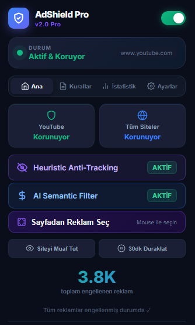

<div align="center">

# 🛡️ AdShield Pro v2.0
### The Ultimate Ad Blocking Experience



[](https://github.com/gkhantyln/AdShieldPro)
[](LICENSE)
[](https://chrome.google.com/webstore)
[](http://makeapullrequest.com)

[**Install Now**](#installation) • [**Features**](#key-features) • [**Contributing**](#contributing)

---
</div>

## 🚀 Overview

**AdShield Pro** is not just another ad blocker. It is a high-performance, intelligent content filtering engine designed to reclaim your browsing experience. Built with a focus on speed, privacy, and user control, AdShield Pro eliminates intrusive ads, trackers, and annoyances across the web, including YouTube.

Say goodbye to distractions and hello to a cleaner, faster, and safer internet.

## ✨ Key Features

- **⚡ Blazing Fast Performance:** Lightweight and optimized for minimal memory usage.
- **🚫 Advanced Ad Blocking:** Automatically blocks banners, pop-ups, video ads, and trackers.
- **🎯 Smart Element Picker:** Point and click to remove ANY element from ANY website permanently. Now with **Dynamic Class Detection** to outsmart anti-adblock scripts.
- **📺 YouTube Ad Defense:** Enjoy uninterrupted video streaming without pre-roll or mid-roll ads.
- **📊 Real-time Statistics:** Visualize how many ads and trackers have been blocked daily and per site.
- **🌑 Dark Mode UI:** A beautiful, modern, and eye-friendly dark interface.
- **🔒 Privacy First:** No data collection. Your browsing history stays on your device.

## 🛠️ Installation

### For Developers (Load Unpacked)

1.  Clone this repository:
    ```bash
    git clone https://github.com/gkhantyln/AdShieldPro.git
    ```
2.  Open **Chrome** and navigate to `chrome://extensions/`.
3.  Enable **Developer mode** (toggle in the top right corner).
4.  Click **Load unpacked**.
5.  Select the `AdShieldPro` directory.
6.  Enjoy a cleaner web! 🎉


## 🔧 Technical Details

- **Manifest V3:** Fully compliant with the latest Chrome extension standards for better security and performance.
- **Declarative Net Request:** Uses the native browser API for efficient blocking without inspecting page content unnecessarily.
- **MutationObserver:** Intelligently monitors DOM changes to catch ads that load dynamically after the page renders.

## 🤝 Contributing

We love open source! Contributions are welcome.

1.  Fork the repository.
2.  Create your feature branch (`git checkout -b feature/AmazingFeature`).
3.  Commit your changes (`git commit -m 'Add some AmazingFeature'`).
4.  Push to the branch (`git push origin feature/AmazingFeature`).
5.  Open a Pull Request.

## 👤 Author

**Gökhan TAYLAN**

- 📷 Instagram: [@ayzvisionstudio](http://instagram.com/ayzvisionstudio)
- 💼 LinkedIn: [gkhantyln](https://www.linkedin.com/in/gkhantyln/)
- 📧 Email: [tylngkhn@gmail.com](mailto:tylngkhn@gmail.com)
- ✈️ Telegram: [@llcoder](https://t.me/llcoder)

## 📄 License

This project is licensed under the MIT License - see the [LICENSE](LICENSE) file for details.

---
<div align="center">
  <sub>Built with ❤️ by Gökhan TAYLAN</sub>
</div>
